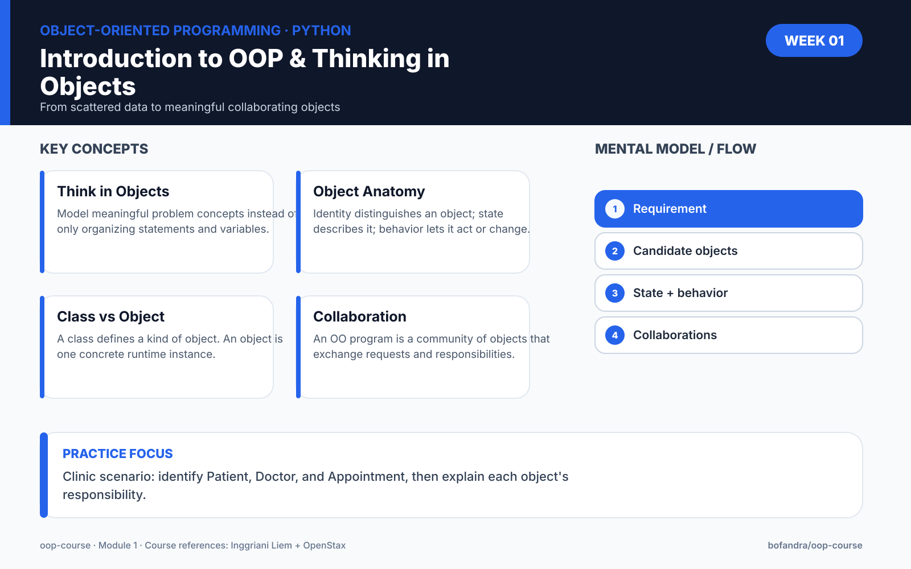

# Module 1 — Introduction to OOP & Thinking in Objects




> **Run the notebook:** [Open Module 1 in Google Colab](https://colab.research.google.com/github/bofandra/oop-course/blob/main/week-01/01_thinking_in_objects.ipynb)

## Learning outcomes

By the end of this module, learners should be able to:

1. explain the basic difference between procedural organization and object-oriented organization;
2. identify candidate objects from a short problem statement;
3. explain **identity, state, and behavior**;
4. distinguish a **class** from an **object/instance** conceptually;
5. explain that an OO program is composed of collaborating objects.

## Key idea

Object-oriented programming is not primarily about writing `class` syntax. It is about modelling a problem using objects that own state, provide behavior, and collaborate.

```text
Object
├── Identity
├── State
└── Behavior
```

## Opening example: from separate variables to objects

```python
patient_name = "Budi"
doctor_name = "Andi"
appointment_time = "10:00"

print(patient_name, doctor_name, appointment_time)
```

Discuss:

- What happens when the clinic has 1,000 patients?
- Which data belongs together?
- Which concepts have their own state and behavior?

The goal is not to declare procedural programming "bad". The goal is to understand why another organization becomes useful as a system grows.

## Thinking in objects

Requirement:

> A clinic receives patient appointments. Each appointment has a patient, a doctor, a time, and a status.

Candidate objects may include:

- Patient
- Doctor
- Appointment

Not every noun automatically becomes a class. `status` and `time`, for example, may simply be attributes/values in this model.

## Class vs object

```python
class Patient:
    pass

patient_1 = Patient()
patient_2 = Patient()
```

For our introductory model:

- `Patient` is the class definition.
- `patient_1` and `patient_2` are two instances/objects.

The detailed mechanics of `__init__`, `self`, and attributes are deliberately postponed to Module 2.

## State and behavior preview

For an Appointment:

```text
State
- patient
- doctor
- time
- status

Possible behavior
- confirm()
- cancel()
- reschedule()
```

At this stage, focus on identifying them rather than implementing them fully.

## Object collaboration

```text
Patient
   │ books
   ▼
Appointment
   │ assigned to
   ▼
Doctor
```

A useful OO system is rarely one giant object. Objects collaborate.

## Main exercise — Library

Requirement:

> A library has books and members. A member can borrow a book.

Before coding, identify:

- candidate objects;
- state of each object;
- behavior of each object;
- possible relationships between them.

Do not assume that every noun must become a class.

## Challenge

Choose one:

- online food delivery;
- university course registration.

Identify at least five candidate objects. For each object, propose state and behavior.

## Reflection

Answer in your own words:

> If all data can be stored in dictionaries and all processes can be written as functions, why might we still choose to model a complex system using objects?

## Reading

### Diktat OOP — Inggriani Liem

Focus on:

- definitions of object-oriented programming;
- object at runtime;
- class vs object;
- object state, behavior, and communication.

### OpenStax

Read **11.1 Object-Oriented Programming Basics**.

## Next module

```text
Class
  ↓
Instantiate
  ↓
Object
  ↓
__init__
  ↓
self
  ↓
Instance state
```


## Module 1 package

- [Colab notebook](01_thinking_in_objects.ipynb)
- [Exercises](exercises.md)
- [Quiz](quiz.md)
- [Assignment](assignment.md)
- [Instructor notes](instructor-notes.md)
- [Mastery checks with worked feedback](../MASTERY_CHECKS.md)

## Course navigation

[← Module 0](../00-python-primer/) · [Course Map](../COURSE_MAP.md) · [Module 2 →](../week-02/)
