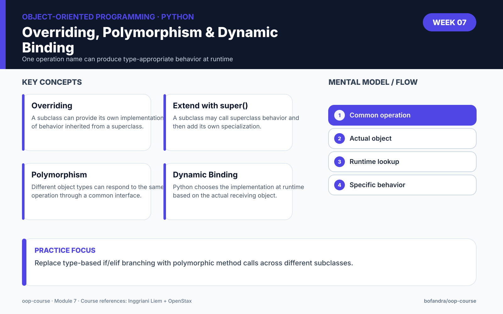

# Module 7 — Overriding, Polymorphism & Dynamic Binding




> **Run the notebook:** [Open Module 7 in Google Colab](https://colab.research.google.com/github/bofandra/oop-course/blob/main/week-07/07_overriding_polymorphism.ipynb)

## Learning outcomes

By the end of this module, learners should be able to:

1. explain why a subclass may need a different implementation of inherited behavior;
2. override an inherited method in Python;
3. use `super()` when a subclass wants to extend rather than completely replace superclass behavior;
4. explain polymorphism as one operation name working across different object types;
5. explain dynamic binding as runtime selection of the method implementation based on the actual object;
6. distinguish **overriding** from **overloading** at a high level;
7. write simple polymorphic code without type-based `if`/`elif` branching.

## Source alignment

Inggriani Liem uses the term **redefinition** for redefining an inherited feature. The Diktat states that polymorphism and dynamic binding are core OO concepts, and defines dynamic binding as the rule that the operation executed at runtime follows the actual runtime object type.

OpenStax 13.3 uses the Python term **method overriding**: a subclass changes inherited behavior by defining a method with the same name. The same section also covers `super()` and polymorphism.

For this course, we connect the terminology as follows:

```text
Liem: feature redefinition
OpenStax/Python: method overriding
```

## From Module 6 to Module 7

Module 6:

```text
Doctor inherits from Person
Developer inherits from Employee
```

Module 7 asks:

> What if the subclass needs a different implementation of an inherited behavior?

## 1. Overriding inherited behavior

```python
class Person:
    def introduce(self):
        print("I am a person")


class Doctor(Person):
    def introduce(self):
        print("I am a doctor")
```

Now:

```python
person = Person()
doctor = Doctor()

person.introduce()
doctor.introduce()
```

The same method name has different implementations.

## 2. Replacing vs extending behavior

Override completely:

```python
class Doctor(Person):
    def introduce(self):
        print("I am a doctor")
```

Or extend the superclass behavior:

```python
class Doctor(Person):
    def introduce(self):
        super().introduce()
        print("My specialty is cardiology")
```

Use `super()` when the superclass implementation is still useful.

## 3. Polymorphism

Create a small inheritance hierarchy with the same operation:

```python
class Notification:
    def send(self):
        print("Sending generic notification")


class EmailNotification(Notification):
    def send(self):
        print("Sending email")


class SMSNotification(Notification):
    def send(self):
        print("Sending SMS")


class PushNotification(Notification):
    def send(self):
        print("Sending push notification")
```

Then:

```python
notifications = [
    EmailNotification(),
    SMSNotification(),
    PushNotification()
]

for notification in notifications:
    notification.send()
```

One call shape:

```text
notification.send()
```

Different runtime objects produce different behavior.

This example intentionally uses a shared superclass so the relationship to **inheritance + overriding** remains explicit. Python can also support polymorphic calls through compatible interfaces without a shared superclass, but that broader duck-typing style is not required for this module.

## 4. Dynamic binding

Suppose:

```python
class Person:
    def role(self):
        print("Person")


class Doctor(Person):
    def role(self):
        print("Doctor")


class Patient(Person):
    def role(self):
        print("Patient")
```

Then:

```python
people = [
    Person(),
    Doctor(),
    Patient()
]

for person in people:
    person.role()
```

The method implementation selected depends on the actual runtime object.

Conceptually:

```text
same operation call
       ↓
runtime object type
       ↓
selected implementation
```

That is the dynamic-binding idea emphasized in the Diktat.

## 5. Polymorphism can reduce type-check branching

Without polymorphism:

```python
if notification_type == "email":
    ...
elif notification_type == "sms":
    ...
elif notification_type == "push":
    ...
```

With polymorphic objects:

```python
notification.send()
```

The caller asks the object to perform its behavior.

## 6. Related but not identical: overriding vs overloading

For Module 7:

```text
Overriding
→ subclass replaces inherited method behavior

Overloading
→ one operation name can have multiple meanings/forms
```

Python operator overloading is studied formally in Module 12.

Do not mix the two concepts.

## Main exercise — Payroll

Model:

```text
Employee
├── FullTimeEmployee
├── PartTimeEmployee
└── Freelancer
```

All classes provide:

```python
calculate_pay()
```

but each subclass calculates pay differently.

Then:

```python
employees = [
    FullTimeEmployee(...),
    PartTimeEmployee(...),
    Freelancer(...)
]

for employee in employees:
    print(employee.calculate_pay())
```

The loop should not ask what subclass each employee belongs to.

## Challenge — Shape

Create:

```text
Shape
├── Rectangle
└── Circle
```

Both subclasses provide:

```python
area()
```

Call `area()` polymorphically through a list of Shape-related objects.

Do not introduce abstract base classes yet. That is Module 9.

## Reflection

Answer:

> Why is `employee.calculate_pay()` usually more extensible than a long `if employee_type == ...` chain?

## Reading

### Inggriani Liem

Focus on:

- polymorphism;
- polymorphic attachment;
- dynamic binding;
- redefinition of inherited features.

### OpenStax

Read **13.3 Methods**:

- overriding methods;
- `super()`;
- polymorphism.

## Module 7 package

- [Colab notebook](07_overriding_polymorphism.ipynb)
- [Exercises](exercises.md)
- [Quiz](quiz.md)
- [Assignment](assignment.md)
- [Instructor notes](instructor-notes.md)
- [Mastery checks with worked feedback](../MASTERY_CHECKS.md)

## Next module

Module 8 is the **Mid Test**.

Learners should now be able to integrate:

```text
Objects
Classes
State & Behavior
Encapsulation
Relationships
Inheritance
Overriding
Polymorphism
```

## Course navigation

[← Module 6](../week-06/) · [Course Map](../COURSE_MAP.md) · [Module 8 →](../week-08/)
