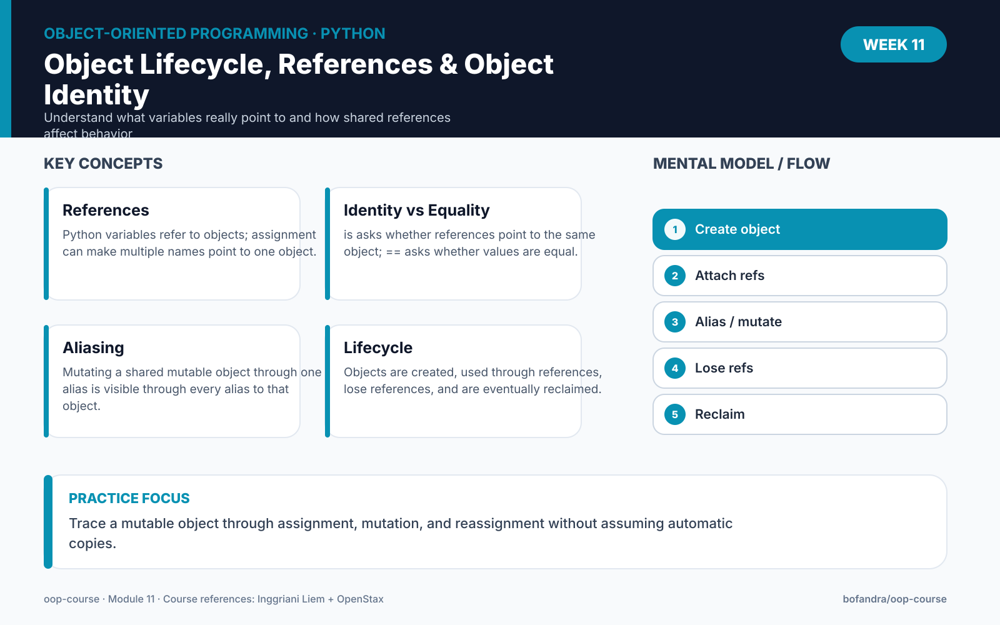

# Module 11 — Object Lifecycle, References & Object Identity




> **Run the notebook:** [Open Module 11 in Google Colab](https://colab.research.google.com/github/bofandra/oop-course/blob/main/week-11/11_object_identity_references.ipynb)

## Learning outcomes

By the end of this module, learners should be able to:

1. explain that Python variables refer to objects rather than storing independent copies of every object;
2. distinguish **object identity** from **value equality**;
3. use `is` and `==` appropriately in simple examples;
4. explain **aliasing** when two names refer to the same mutable object;
5. distinguish **mutation** from **reassignment**;
6. predict the effect of mutating an object through one alias;
7. explain the basic lifecycle of an object: creation, use through references, loss of references, and eventual memory reclamation;
8. explain automatic memory management conceptually without depending on implementation-specific garbage-collection timing.

## Source alignment

Inggriani Liem treats objects as **runtime entities** that are dynamically created, manipulated, and eventually destroyed. The Diktat explicitly discusses:

- object creation and initialization;
- references as object identifiers;
- assignment between references;
- **dynamic aliasing**, where two references become attached to the same object;
- copying versus reference assignment;
- object destruction and garbage collection.

The Diktat's reference examples use Eiffel/C++/Java terminology. This module translates the same runtime ideas into Python.

OpenStax **3.3 Variables revisited** is the Python-facing source for variables, object identity, aliasing, and identity checks. The course uses Python's `id()`, `is`, mutable objects, and reassignment to make these ideas observable.

## From Module 10 to Module 11

Modules 6–10 focused heavily on class structures:

```text
classes
inheritance
polymorphism
abstract classes
multiple inheritance
```

Module 11 returns to runtime:

> When we write two variable names, do we have two objects—or two references to one object?

## 1. Variables refer to objects

Consider:

```python
class Student:
    def __init__(self, name):
        self.name = name


student_a = Student("Alya")
student_b = student_a
```

Conceptually:

```text
student_a ──┐
            ├──> Student object
student_b ──┘
```

There is one Student object and two names referring to it.

## 2. Identity

Python provides `is` to test whether two references identify the **same object**.

```python
print(student_a is student_b)
```

For the example above, the result is:

```text
True
```

Python's `id()` can also help demonstrate object identity during an object's lifetime:

```python
print(id(student_a))
print(id(student_b))
```

Do not treat the numeric value returned by `id()` as a business identifier. It is only a runtime observation tool here.

## 3. Identity vs equality

These are different questions:

```text
is
→ Are these the same object?

==
→ Are these values considered equal?
```

Example with lists:

```python
a = [1, 2, 3]
b = [1, 2, 3]

print(a == b)
print(a is b)
```

The lists can have equal contents while still being different objects.

## 4. Aliasing

When:

```python
x = [10, 20]
y = x
```

both names refer to the same list.

Then:

```python
y.append(30)
print(x)
```

also changes what we observe through `x`, because there is still only one underlying list object.

This is the Python version of the **dynamic aliasing** idea discussed in the Diktat.

## 5. Mutation vs reassignment

Mutation changes an existing object:

```python
x = [1, 2]
y = x

y.append(3)
```

Now both names still refer to the same mutated object.

Reassignment changes which object a name refers to:

```python
y = [100, 200]
```

Now:

```text
x ─────> [1, 2, 3]

y ─────> [100, 200]
```

The original object was not transformed into the new list. The name `y` was rebound.

## 6. Aliasing with custom objects

```python
class BankAccount:
    def __init__(self, balance):
        self.balance = balance

    def deposit(self, amount):
        self.balance += amount


account_a = BankAccount(100_000)
account_b = account_a

account_b.deposit(50_000)

print(account_a.balance)
```

The result reflects the same underlying BankAccount object.

This is important when objects collaborate and share references.

## 7. Assignment is not automatically a copy

This:

```python
account_b = account_a
```

does not automatically create another independent BankAccount object.

Conceptually:

```text
reference assignment
≠
object copy
```

Copying is a separate operation and may be shallow or deep depending on the language/tool. Module 11 only introduces that distinction conceptually; advanced copying mechanics are not the focus.

## 8. Object lifecycle

A simplified runtime lifecycle:

```text
Class definition
      ↓
Object creation
      ↓
References point to object
      ↓
Object is used / mutated
      ↓
References may be reassigned or disappear
      ↓
Object may become unreachable
      ↓
Memory can eventually be reclaimed
```

The Diktat discusses object destruction and garbage collection as part of object runtime dynamics.

In Python, memory management is automatic. For this course, do not rely on the exact moment an unreachable object is reclaimed.

## 9. Reference disappears, object may remain

```python
student_a = Student("Alya")
student_b = student_a

student_a = None
```

The Student object still has a reference through `student_b`.

Conceptually:

```text
student_a ──> None

student_b ──> Student object
```

The object is therefore still reachable.

## 10. When no application reference remains

```python
student_b = None
```

Now, in this simplified example, application code no longer has a reference to that Student object.

The object becomes eligible for automatic memory reclamation.

Do not teach:

> `= None` immediately destroys the object.

That statement is too strong. The important concept is **reachability and references**, not exact collection timing.

## Main exercise — Shared Shopping Cart

Create:

```python
cart_a = []
cart_b = cart_a
```

Then:

1. append an item through `cart_a`;
2. append another item through `cart_b`;
3. inspect both;
4. check `cart_a is cart_b`;
5. reassign `cart_b` to a new list;
6. inspect identity and contents again.

Draw the references before and after reassignment.

## Challenge — Shared Student Object

Create one Student object and assign it to two names.

Mutate the student's name or another attribute through one reference.

Then:

- observe the change through the other reference;
- use `is`;
- explain why no second Student object was created.

Finally, create a genuinely independent second Student object with equal attribute values and compare:

- identity;
- value/state.

## Reflection

Answer:

> Why can aliasing be useful for object collaboration, but also become a source of bugs when programmers forget that several references point to the same mutable object?

## Reading

### Inggriani Liem

Focus on:

- object runtime dynamics;
- creation and manipulation of objects;
- references as object identifiers;
- assignment and dynamic aliasing;
- copy versus reference assignment;
- object destruction and garbage collection.

### OpenStax

Read **3.3 Variables revisited** for Python variable/object identity and aliasing concepts.

## Module 11 package

- [Colab notebook](11_object_identity_references.ipynb)
- [Exercises](exercises.md)
- [Quiz](quiz.md)
- [Assignment](assignment.md)
- [Instructor notes](instructor-notes.md)
- [Mastery checks with worked feedback](../MASTERY_CHECKS.md)

## Next module

Module 11 explains how objects behave at runtime.

Module 12 moves to several language-level class features:

> How can our own classes interact naturally with operators, represent generic ideas, and be organized across modules?

That leads to:

**Module 12 — Operator Overloading, Genericity & Organizing Classes into Modules.**

## Course navigation

[← Module 10](../week-10/) · [Course Map](../COURSE_MAP.md) · [Module 12 →](../week-12/)
